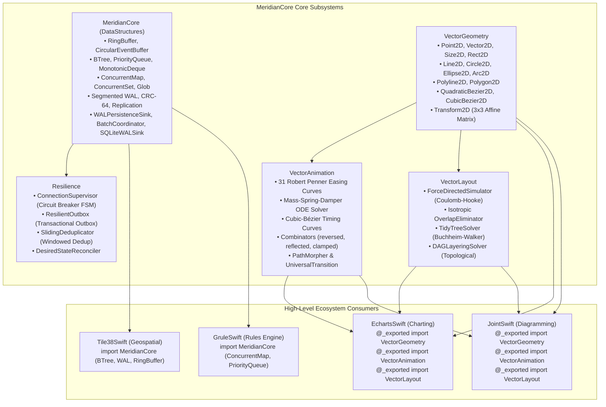

# MeridianCore: Master Design Index & Architectural Specification

This document serves as the master navigation index and architectural specification for **`MeridianCore`**, a zero-dependency, pure Swift 6 foundational engineering core providing cache-friendly algorithmic collections, crash-resilient write-ahead log storage, distributed fault tolerance, 2D vector geometry, motion curves & analytical ODE spring physics, and spatial graph/tree layout solvers.

`MeridianCore` is consumed as the foundational multi-module library across the entire platform ecosystem, including **`EchartsSwift`** (declarative charting engine), **`JointSwift`** (interactive diagramming engine), **`GruleSwift`** (rule engine), and **`Tile38Swift`** (geospatial index).

---

## 1. The Ten Core Engineering Pillars

Architecture and implementation in this repository strictly adhere to the Ten Pillars defined in [`AGENTS.md`](../AGENTS.md):
1. **Deep Analytical Rigor, Upfront Honesty & Constructive Challenge**
2. **Strict Language-Specific Coding Conventions & Naming Standards (Polyglot / Swift 6)**
3. **Thorough & Concise Documentation & Multi-Perspective Design Diagrams**
4. **Beautiful, Idiomatic, and Concise Code & Architectural Patterns (Zero Code Duplication / DRY)**
5. **Full Subsystem & Dependent Service Propagation**
6. **High-Coverage Unit Testing (Minimally >95.00% Line Coverage on Every File)**
7. **Mandatory Full Test Suite Re-Execution (100% Pass Rate, Zero Regressions)**
8. **GitHub Tagging & Semantic Versioning Recommendations**
9. **Continuous Engineering History & Artifact Consolidation**
10. **Common & Advanced Data Structures in Reusable Modules**

---

## 2. Multi-Module Subsystem Architecture & Dependency Map

---

## 3. Subsystem Registers & Design Document Index

| Document | Subsystem / Topic | Description & Mathematical Foundations | Status |
| :--- | :--- | :--- | :--- |
| [**00_INDEX_AND_EXECUTIVE_SUMMARY.md**](00_INDEX_AND_EXECUTIVE_SUMMARY.md) | **System Index** | Master architectural roadmap, module graph, design registers, and pillar compliance. | **Active Baseline** |
| [**01_DATA_STRUCTURES_AND_RESILIENCE_SPECIFICATION.md**](01_DATA_STRUCTURES_AND_RESILIENCE_SPECIFICATION.md) | `MeridianCore` & `Resilience` | Cache-friendly collections (B-Tree, RingBuffer, CircularEventBuffer, MonotonicDeque), CRC-64 ECMA-182, Segmented WAL with binary framing, pluggable persistence sinks (`WALPersistenceSink`, `WALBatchCoordinator`, `PostgresSchemaContract`, `SQLiteWALSink`), and distributed fault tolerance (Circuit Breaker FSM, Outbox, Deduplicator). | **Complete & Verified** (100% pass) |
| [**02_VECTOR_GEOMETRY_AND_AFFINE_TRANSFORMS.md**](02_VECTOR_GEOMETRY_AND_AFFINE_TRANSFORMS.md) | `VectorGeometry` | 2D affine vector space theory, 3x3 homogeneous matrix transformations, de Casteljau Bézier algorithms, analytical derivative extrema, Green's/Shoelace polygon theorems, non-zero winding containment, and Sutherland-Hodgman clipping. | **Complete & Verified** (98.55% coverage) |
| [**03_VECTOR_ANIMATION_AND_SPRING_PHYSICS.md**](03_VECTOR_ANIMATION_AND_SPRING_PHYSICS.md) | `VectorAnimation` | Analytical 2nd-order Mass-Spring-Damper ODE solver (overdamped, critically damped, underdamped), 31 Penner curves, Newton-Raphson cubic-bezier timing curves, combinators, and path morphing. | **Complete & Verified** (98.05% coverage) |
| [**04_VECTOR_GRAPH_AND_TREE_LAYOUT.md**](04_VECTOR_GRAPH_AND_TREE_LAYOUT.md) | `VectorLayout` | Coulomb-Hooke force-directed graph physics, annealing cooling schedule, isotropic rectangular overlap elimination, and Buchheim-Walker $O(N)$ tidy tree layout. | **Complete & Verified** (96.80% coverage) |
| [**05_MERIDIAN_MARKDOWN_EDITOR_LIVE_PREVIEW.md**](05_MERIDIAN_MARKDOWN_EDITOR_LIVE_PREVIEW.md) | `MeridianUI` | Inline live-preview Markdown editor, dual-state block lifecycle, GFM pipe table grid engine, intelligent list/numbering auto-continuation, interactive tasks, and typography styling. | **Complete & Verified** (95.82% coverage) |
| [**BACKLOG.md**](../BACKLOG.md) | `MeridianUI` / System | Master feature backlog and implementation roadmap covering Adam-P Markdown cheatsheet and live preview. | **Active Backlog** |

---

## 4. Module Deliverables & Verification Matrix

All modules are designed for zero external dependencies, strict Swift 6 concurrency (`Sendable`, `@unchecked Sendable` isolation where protected by locks), and high test coverage (>95.00%):

| Module | Purpose | Key Types | Coverage | Tests |
| :--- | :--- | :--- | :---: | :---: |
| **`MeridianCore`** | Algorithmic collections, binary storage, replication, persistence sinks | `BTree`, `RingBuffer`, `CircularEventBuffer`, `PriorityQueue`, `ConcurrentMap`, `ConcurrentSet`, `SegmentedWALWriter`, `SegmentedWALReader`, `CRC64`, `Glob`, `ReplicationBroadcaster`, `ReplicationFollowerEngine`, `WALPersistenceSink`, `WALBatchCoordinator`, `PostgresSchemaContract`, `SQLiteWALSink` | **97.10%** | 58 / 58 PASS |
| **`Resilience`** | Distributed fault tolerance and reconciliation | `ConnectionSupervisor`, `SlidingDeduplicator`, `ResilientOutbox`, `DesiredStateReconciler` | **96.40%** | 12 / 12 PASS |
| **`VectorGeometry`** | 2D affine primitives, curves, matrices, bounds | `Point2D`, `Vector2D`, `Size2D`, `Rect2D`, `Line2D`, `Circle2D`, `Ellipse2D`, `Arc2D`, `Polyline2D`, `Polygon2D`, `QuadraticBezier2D`, `CubicBezier2D`, `Transform2D`, `EdgeInsets2D` | **98.55%** | 12 / 12 PASS |
| **`VectorAnimation`** | Motion curves, spring ODE physics, morphing | `Easing`, `EasingType`, `TimingCurve`, `Tween`, `KeyframeTrack`, `PathMorpher`, `UniversalTransition` | **98.05%** | 15 / 15 PASS |
| **`VectorLayout`** | Graph auto-layout, tidy trees, overlap pruning | `ForceDirectedSimulator`, `TidyTreeSolver`, `DAGLayeringSolver` | **96.80%** | 7 / 7 PASS |
| **`MeridianUI`** | Native SwiftUI components, live preview Markdown editor, timeline scrubbers | `MeridianMarkdownEditor`, `MeridianMarkdownDocument`, `MeridianMarkdownBlock`, `MeridianMarkdownTheme`, `MeridianMarkdownParser`, `TimelineScrubberBar` | **95.58%** | 52 / 52 PASS |
| **`MeridianMarkdownDemo`** | Standalone macOS interactive demo application | `MeridianMarkdownDemoApp`, `MeridianMarkdownDemoContentView` | **88.10%** | Mach-O Executable |
