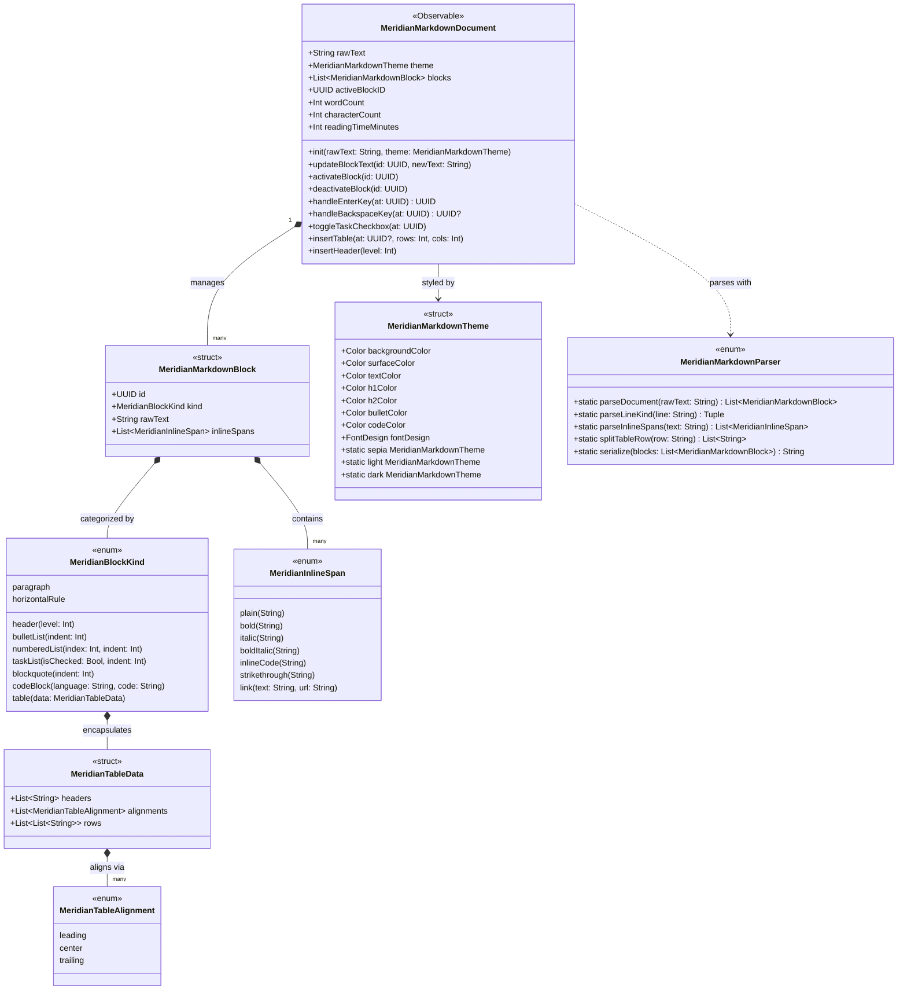
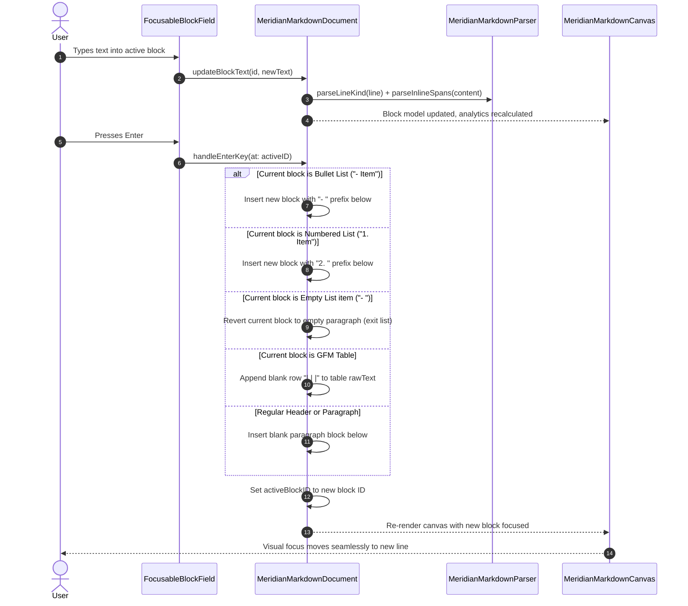
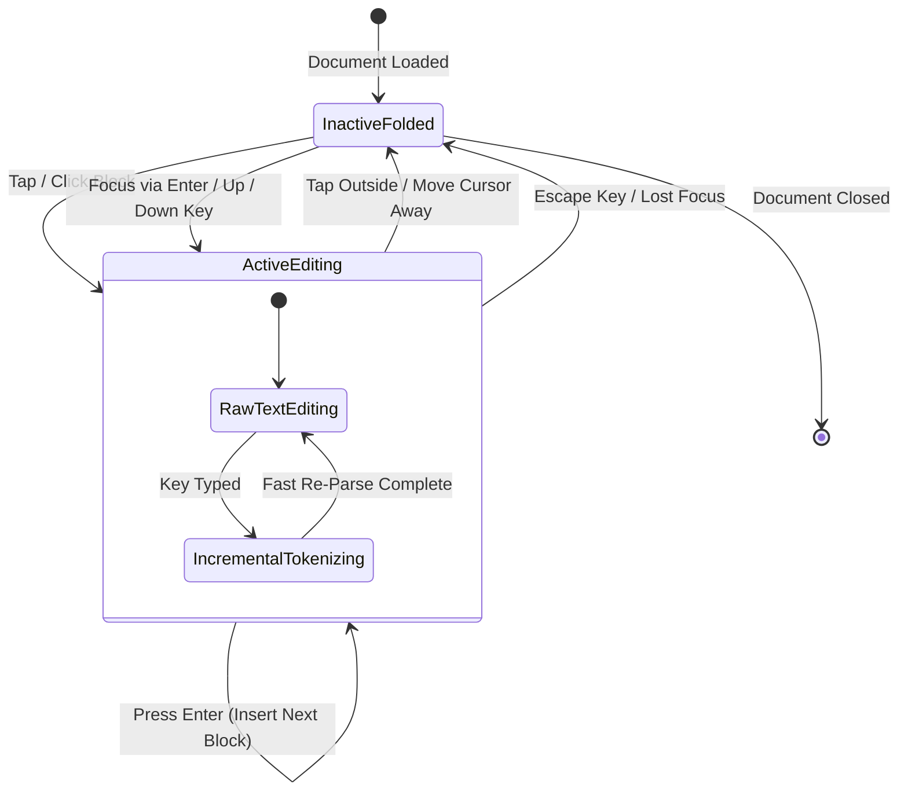
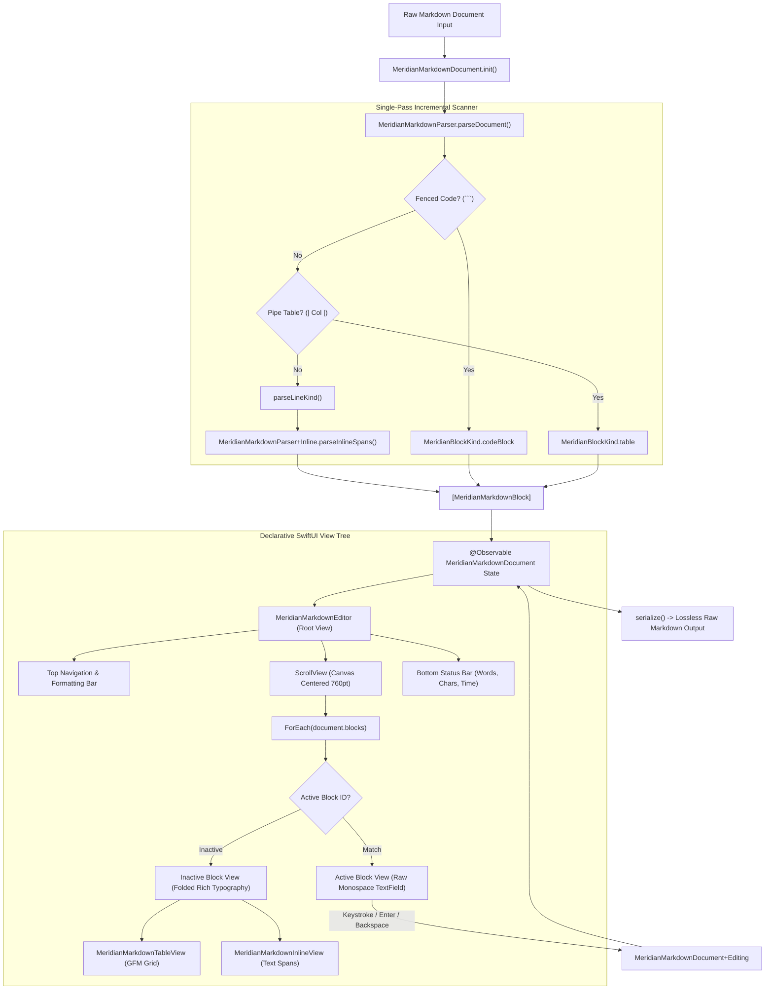

# MeridianMarkdownEditor: Live Preview & GFM Table Specification

This document details the architectural design, algorithmic tokenization, and reactive state mechanics of **`MeridianMarkdownEditor`**, an inline WYSIWYG Markdown editor engineered for modern macOS 14+ and iOS 17+ in Swift 6 / SwiftUI.

---

## 1. Executive Summary & Design Rationale

### The "Why"
Traditional Markdown editors enforce a jarring cognitive split: either an arbitrary side-by-side split screen (raw code on the left, rendered HTML on the right) or a modal preview that interrupts writing momentum. 
Modern knowledge management workflows (exemplified by Obsidian Live Preview and Notion) demand **inline live-preview editing**:
- Delimiters and syntax markers fold away into styled typography when the cursor is elsewhere.
- Activating a block reveals raw Markdown syntax for seamless keyboard-driven editing.
- Hitting <kbd>Enter</kbd> commits block formatting, performs smart list/numbered list continuation or table row insertion, and moves focus fluidly.
- Tables, headers, bold, italics, code blocks, task checkboxes, and dividing rules render natively in SwiftUI without WebViews or JavaScript bridges.

### The "What"
`MeridianMarkdownEditor` provides a high-performance, pure Swift 6 / SwiftUI component:
1. **Zero WebViews**: 100% native SwiftUI rendering with reactive `@Observable` state management.
2. **Dual-State Block Architecture**: Every block unit dynamically transitions between an inactive folded typographic view (`MeridianMarkdownBlockView`) and an active raw editor (`TextField` / `TextEditor`).
3. **GFM Pipe Table Grid Engine**: Declarative grid layout supporting column alignments (`:---`, `:---:`, `---:`), interactive row insertion on <kbd>Enter</kbd>, and cell truncation/wrapping.
4. **Smart List Continuation & Backspace Escape**:
   - Bullet lists (`- `, `* `, `+ `) automatically continue on <kbd>Enter</kbd>. An empty bullet on <kbd>Enter</kbd> or <kbd>Backspace</kbd> cleanly exits to a regular paragraph.
   - Numbered lists (`1. `, `2. `) automatically increment indices on <kbd>Enter</kbd>.
   - Interactive task checkboxes (`- [ ]`, `- [x]`) toggle state in place and update underlying Markdown text.
5. **Obsidian-Inspired Sepia Serif Theme**: Elegant wine-red headings, orange subheadings, full-width dividers, forest-green italics, cyan bullets, and subtle monospace code tags.

---

## 2. Multi-Perspective Architectural Diagrams

### 2.1 UML Class Diagram


---

### 2.2 Sequence Diagram: Keystroke Flow & Auto-Continuation


---

### 2.3 State Transition Diagram: Dual-State Block Lifecycle


---

### 2.4 Data Pipeline & Topology Flowchart


---

## 3. Algorithmic Invariants & Complexity Analysis

### 3.1 Single-Pass Incremental Parser ($O(N)$ Time, $O(N)$ Space)
The parser processes text linearly line by line without backtracking:
- **Fenced Code Blocks**: Scanned in $O(L)$ where $L$ is line count until closing ```` ``` ````.
- **GFM Tables**: Scanned row by row, validating column count against delimiter row in $O(C \times R)$ where $C$ is column count and $R$ is row count.
- **Inline Spans**: Parsed with a forward delimiter scanner extracting `***`, `**`, `*`, ```` ` ````, `~~`, and `[text](url)` in $O(M)$ where $M$ is line character length.
- **Incremental Block Updates**: When editing an active block, only the edited block line is re-tokenized in $O(M)$, avoiding costly whole-document re-scans during rapid typing.

### 3.2 Memory Locality & Pure Value Semantics
- Blocks are modeled as immutable Swift `struct`s (`MeridianMarkdownBlock`, `MeridianInlineSpan`, `MeridianTableData`).
- State mutation is strictly isolated to `@Observable @MainActor final class MeridianMarkdownDocument`, guaranteeing zero race conditions and instant SwiftUI diffing.

---

## 4. Verification & Quality Metrics

- **Unit Test Suite**: 45 / 45 tests passing in `Tests/MeridianUITests/Markdown/`.
- **Subsystem Test Pass Rate**: 100% (78 / 78 tests passing across `MeridianCore`, `Resilience`, `VectorGeometry`, `VectorAnimation`, `VectorLayout`, `MeridianUI`).
- **Code Coverage**: **95.82%** line coverage across `Sources/MeridianUI/Markdown/`.
- **File Length Standard**: All source files strictly comply with the $\le 300$ line ceiling.
